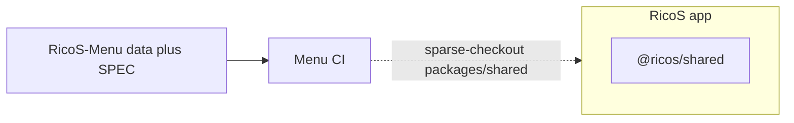
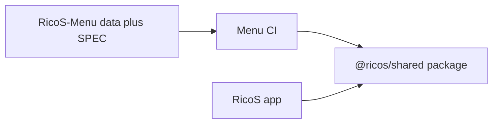

# RicoS-Menu

Public menu catalog for [RicoS](https://github.com/kilogold/RicoS). Each branch is an independent publish target.

## Rules

- **Do not** merge `preview` into `main` to promote menu content. Production and preview menus evolve separately.
- **Staff publish** should go through the RicoS admin menu editor (`POST /api/staff/admin/menu/commit-publish`), which bumps `catalogVersion` and updates `publishedAt`.
- **Direct git pushes** must increment `catalogVersion` by exactly `+1` and set `publishedAt` strictly later than the previous revision. CI enforces this on push.

## CI

This repo owns catalog **data** and **SPEC**. Executable schema (`parseMenuCatalogFile`) belongs in `@ricos/shared`, consumed by both RicoS and this CI.

**Current approximation** — shared lives inside the RicoS repo; Menu CI sparse-checkouts that folder:



**Ideal** — shared is a standalone package both depend on:



`.github/workflows/menu-catalog-ci.yml` runs:

1. `scripts/verify-menu-catalog-version.mjs` — schema + `catalogVersion` / `publishedAt` rules when `menu.json` changes.
2. `scripts/trigger-menu-revalidate.mjs` — `POST` to RicoS `/api/menu/revalidate` so the storefront cache picks up the new version (skipped when `menu.json` is unchanged).

### GitHub Actions secrets (RicoS-Menu repo)

| Secret | Value |
|--------|--------|
| `RICOS_PREVIEW_REVALIDATE_URL` | `https://<preview-host>/api/menu/revalidate` (no query string) |
| `RICOS_VERCEL_PROTECTION_BYPASS` | Vercel **Protection Bypass for Automation** secret (preview only) |
| `RICOS_PRODUCTION_REVALIDATE_URL` | `https://<production-host>/api/menu/revalidate` |

CI sends the bypass as the `x-vercel-protection-bypass` header (query params break Next.js API routing).

Local test:

```bash
GITHUB_REF_NAME=preview \
MENU_CATALOG_BASE_REF=HEAD~1 \
RICOS_PREVIEW_REVALIDATE_URL=https://web-git-preview-kelvin-bonillas-projects.vercel.app/api/menu/revalidate \
RICOS_VERCEL_PROTECTION_BYPASS=<secret> \
bun scripts/trigger-menu-revalidate.mjs
```

## Specification

See [SPEC.md](./SPEC.md) for the full menu catalog specification (modifier groups, `visibleWhen`, combo example).
