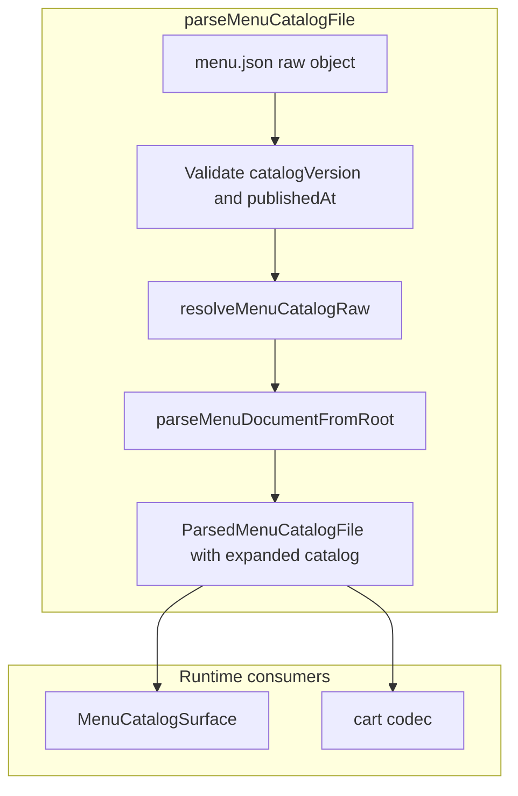
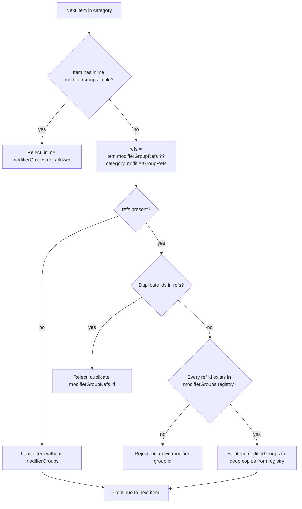

# Specification

How `menu.json` models menu data on disk. Parsing expands compact refs into the same runtime item shape used by RicoS checkout, kitchen tickets, and admin tooling.

## Document shape

Each catalog file has release fields plus a menu body:

| Field | Purpose |
|-------|---------|
| `catalogVersion` | Integer bumped on every publish |
| `publishedAt` | ISO timestamp; must increase each publish |
| `restaurant`, `menuName` | Bilingual labels |
| `orderFees` | Checkout fees (e.g. service charge rate) |
| `modifierGroups` | Global registry of reusable modifier groups (required when any item uses refs) |
| `categories[]` | Menu sections (category payloads; array order is not used for storefront display) |
| `themes` | Required map of theme name → ordered category ids; controls storefront grouping and sort order |

### `themes`

Shape: `Record<string, string[]>` — each key is an English display label; each value lists category ids in display order within that theme.

Example:

```json
"themes": {
  "Breakfast": ["cat_breakfast_griddles", "cat_omelettes", "cat_egg_plates", "cat_hot_cereals"],
  "Sandwiches": ["cat_sandwiches"],
  "Burgers": ["cat_burgers", "cat_appetizers"]
}
```

Rules:

- `themes` is **required** (catalogs without it fail parse; no migration or fallback).
- Theme section order follows **object key insertion order** in the JSON file.
- Category order within a theme follows each theme’s array order.
- Every `categories[].id` must appear **exactly once** across all theme arrays.
- Theme values must not reference unknown category ids.
- Theme names are opaque English labels shown on the storefront for both locales (not `LocalizedText`).

Each category has:

- `id`, localized `title`, `notes[]`, `items[]`
- optional `modifierGroupRefs: string[]` (default modifier stack for all items in the category)

Each item has:

- `id`, localized `name`, localized `description`, `priceCents`, `station`, tax rates
- optional `modifierGroupRefs: string[]` (overrides the category default for that item only)

Items must **not** include inline `modifierGroups[]` in `menu.json`. Use refs plus the top-level registry instead.

## Two primitives for modifiers

### 1) `modifierGroups` registry

Top-level object map from modifier group id to full group definition:

```json
"modifierGroups": {
  "mod_sandwich_format": {
    "id": "mod_sandwich_format",
    "title": { "en": "Make it a Combo", "es": "Hazlo Combo" },
    "selectionType": "single",
    "required": true,
    "minSelections": 1,
    "maxSelections": 1,
    "options": [
      { "id": "opt_format_individual", "label": { "en": "Individual", "es": "Individual" } },
      { "id": "opt_format_combo", "label": { "en": "Combo", "es": "Combo" }, "priceDeltaCents": 399 }
    ]
  }
}
```

### 2) `modifierGroupRefs`

Ordered list of group ids attached to a category or item:

```json
"modifierGroupRefs": [
  "mod_sandwich_bread",
  "mod_tortilla_type",
  "mod_sandwich_format",
  "mod_combo_side",
  "mod_combo_drink"
]
```

Order is preserved and controls display/validation order.

## Conditional groups (`visibleWhen`)

Some modifier groups only apply after the customer picks a specific option in another group (e.g. combo side and drink after **Combo**). Declare that dependency on the group in the registry with optional `visibleWhen`:

```json
"visibleWhen": {
  "groupId": "mod_sandwich_format",
  "optionIds": ["opt_format_combo"]
}
```

- `groupId` — parent modifier group (must appear earlier in the same item’s `modifierGroupRefs` order).
- `optionIds` — parent is satisfied if the customer selected any of these options.

At checkout, RicoS marks the group **active** only when the rule matches; inactive groups are hidden and must stay empty in cart selections. When active, normal `required` / min / max rules apply. Combo surcharges belong on the triggering option (`priceDeltaCents`), not on dependent groups.

## Authoring rules

- **Change a choice once:** edit the group in `modifierGroups` (labels, options, `visibleWhen`, surcharges). Every item that references that id picks up the change.
- **Same stack on many items:** set `modifierGroupRefs` on the category; leave items bare unless one dish differs.
- **One id, one meaning:** never reuse a group id for a different option set—split into a new id instead.
- **Ref order matters:** list parent groups before any group that uses `visibleWhen` on them.
- **Publish:** bump `catalogVersion` by 1 and set a later `publishedAt` (CI enforces this on push).
- **Themes:** assign every category to exactly one theme; reorder themes or category lists to change storefront layout.

## Resolution rules

Parser resolution runs before normal item validation:

1. `refs = item.modifierGroupRefs ?? category.modifierGroupRefs`
2. If the item has inline `modifierGroups[]` in the catalog file, validation fails.
3. If `refs` exist:
   - each id must exist in top-level `modifierGroups`
   - ref ids must not repeat within the same list
   - the parser expands refs into `item.modifierGroups[]` (deep copy from the registry)
4. If there are no refs, the item has no modifiers.

After parse, RicoS always works with expanded items that carry inline `item.modifierGroups[]`. That shape is produced by resolution (or held in memory in the admin editor); it is not authored directly in `menu.json`.

Publish serializes the expanded catalog back to registry + refs via `compactMenuCatalogForDisk`.

### Parsing flow and order

`parseMenuCatalogFile` runs in this order:



Inside `resolveMenuCatalogRaw`, the registry is built once, then each category and item is processed in array order. Per item:



After all items are resolved, the top-level `modifierGroups` key is removed from the working object. `parseMenuDocumentFromRoot` then validates the expanded tree (`themes`, categories, items, stations, tax rates, and each expanded modifier group including `visibleWhen`). `parseThemes` cross-checks `themes` against parsed category ids (bijection).

Storefront display uses `buildThemedMenuSections`: walk `themes` in key order, resolve each category id from `categories[]`.

Publish reverses the on-disk shape:


`compactMenuCatalogForDisk` preserves `themes` on disk unchanged from the in-memory catalog.