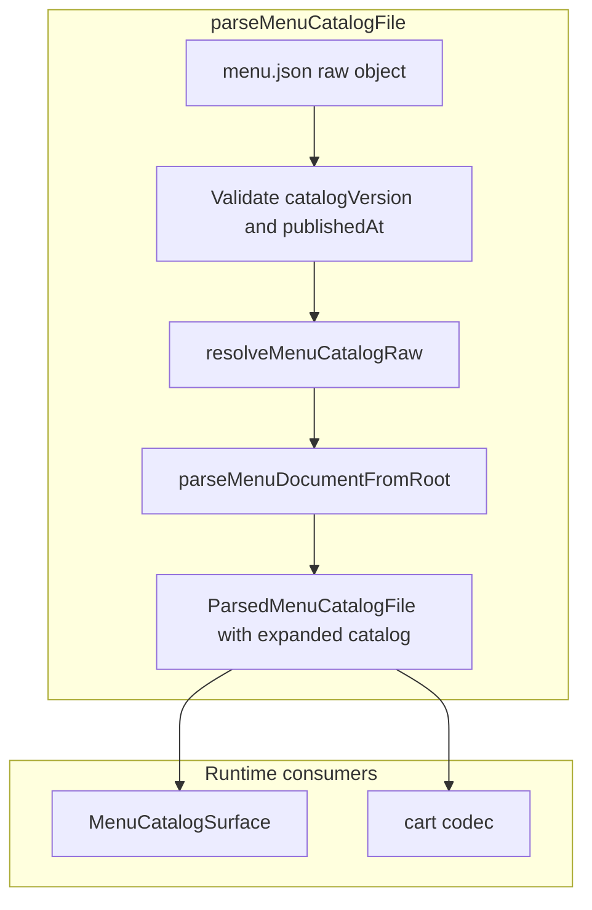
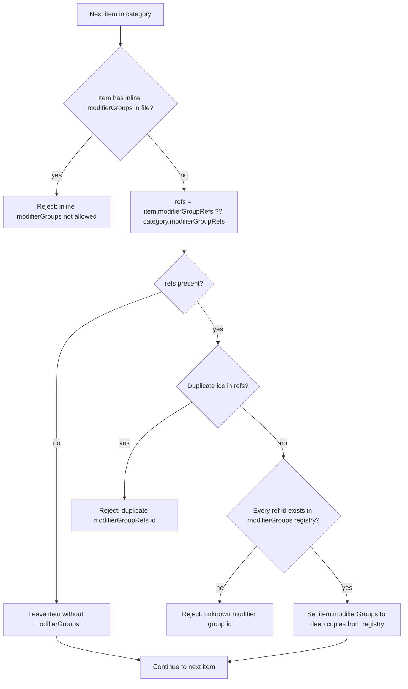

# Specification

How `menu.json` models menu data on disk. Parsing expands compact refs into the same runtime item shape used by RicoS checkout, kitchen tickets, and admin tooling.

## Document shape

Each catalog file has release fields plus a menu body:

| Field | Purpose |
|-------|---------|
| `catalogVersion` | Integer bumped on every publish |
| `publishedAt` | ISO timestamp; must increase each publish |
| `restaurant`, `menuName` | Bilingual labels |
| `orderFees` | Checkout fees (e.g. service charge rate) |
| `modifierGroups` | Global registry of reusable modifier groups (required when any item uses refs) |
| `categories[]` | Menu sections (category payloads; array order is not used for storefront display) |
| `themes` | Required map of theme name → ordered category ids; controls storefront grouping and sort order |
| `themeAvailability` | Optional map of theme name → days and time windows when that theme is orderable on the storefront |

### `themes`

Shape: `Record<string, string[]>` — each key is an English display label; each value lists category ids in display order within that theme.

Example:

```json
"themes": {
  "Breakfast": ["cat_breakfast_griddles", "cat_omelettes", "cat_egg_plates", "cat_hot_cereals"],
  "Sandwiches": ["cat_sandwiches"],
  "Burgers": ["cat_burgers", "cat_appetizers"]
}
```

Rules:

- `themes` is **required** (catalogs without it fail parse; no migration or fallback).
- Theme section order follows **object key insertion order** in the JSON file.
- Category order within a theme follows each theme’s array order.
- Every `categories[].id` must appear **exactly once** across all theme arrays.
- Theme values must not reference unknown category ids.
- Theme names are opaque English labels shown on the storefront for both locales (not `LocalizedText`).

### `themeAvailability`

Optional schedule for **whole themes** (all categories listed under that theme). Used for menus such as lunch that are only orderable during certain days and hours.

Shape:

```json
"themeAvailability": {
  "Lunch": {
    "days": ["mon", "tue", "wed", "thu", "fri"],
    "windows": [{ "start": "11:00", "end": "15:00" }]
  }
}
```

Rules:

- Omit `themeAvailability` entirely when no theme uses a schedule (backward compatible).
- Keys must match keys in `themes`; unknown theme keys fail parse.
- Themes **without** an entry are always orderable on the storefront (subject only to store open/closed).
- `days` — non-empty array of lowercase weekday codes: `sun`, `mon`, `tue`, `wed`, `thu`, `fri`, `sat`.
- `windows` — non-empty array of `{ start, end }` with `HH:MM` 24-hour times; each window is half-open `[start, end)` on the same calendar day (`start` must be strictly before `end`; overnight spans are not supported in v1).
- Evaluation uses RicoS store wall clock: `America/Puerto_Rico` (same timezone as store open/last-call env).
- A theme is **active** when the current weekday is in `days` and the current local time falls in at least one window.
- **Storefront (inactive):** the theme section remains visible; items are browse-only (no add-to-cart); a schedule indicator is shown. Other themes are unaffected (additive).
- **Storefront (active):** normal ordering for that theme.
- **Cart / checkout:** schedule does not invalidate lines already in the cart (display-only filter).
- **Store open:** independent of `STORE_*` env — a theme can be inactive while the store accepts orders.

Each category has:

- `id`, localized `title`, `notes[]`, `items[]`
- optional `modifierGroupRefs: string[]` (default modifier stack for all items in the category)

Each item has:

- `id`, localized `name`, localized `description`, `priceCents`, `station`, tax rates
- required `thumbnailPathname` — relative Vercel Blob pathname for the item thumbnail (not a URL)
- optional `modifierGroupRefs: string[]` (overrides the category default for that item only)

`thumbnailPathname` rules:

- Required on every item (catalogs without it fail parse; no migration or fallback at parse time).
- Non-empty relative pathname only (e.g. `menu-thumbnails/item_turkey_sandwich.webp`).
- Must not be an absolute URL, must not start with `/`, and must not have leading/trailing whitespace.
- Well-known shared fallback blob pathname (app constant): `menu-thumbnails/fallback.webp`.
- The RicoS web app resolves pathnames against `NEXT_PUBLIC_MENU_BLOB_BASE_URL` (public blob store origin).
- Storefront may hide the well-known fallback via `NEXT_PUBLIC_MENU_THUMBNAIL_FALLBACK_MODE=skip` (default `show`); this is display-only and does not change the catalog.
- **Gallery (admin):** immutable uploads under `menu-thumbnails/{itemId}-<random>` (persist the pathname returned by Blob; `contentType` is set on put). Custom thumbnails are **1:1** with items; `fallback.webp` is the only shared placeholder. Clear sets the draft pathname to fallback (does not delete the blob). Catalog pathnames update on publish; Blob upload/delete is immediate and separate. Manual prune uses draft-only “referenced” math — older git SHAs may break after delete. No same-pathname restore; catalog reverts are manual and must re-assign/upload thumbs in the reverting commit.
- **Runtime:** a missing custom blob URL is treated like a fallback-designated item (same `NEXT_PUBLIC_MENU_THUMBNAIL_FALLBACK_MODE` show/skip rules) via image `onError`. If `fallback.webp` itself fails, that is a loud infra failure (do not silently drop the image chrome).

Items must **not** include inline `modifierGroups[]` in `menu.json`. Use refs plus the top-level registry instead.

## Two primitives for modifiers

### 1) `modifierGroups` registry

Top-level object map from modifier group id to full group definition:

```json
"modifierGroups": {
  "mod_sandwich_format": {
    "id": "mod_sandwich_format",
    "title": { "en": "Make it a Combo", "es": "Hazlo Combo" },
    "selectionType": "single",
    "required": true,
    "minSelections": 1,
    "maxSelections": 1,
    "options": [
      { "id": "opt_format_individual", "label": { "en": "Individual", "es": "Individual" } },
      { "id": "opt_format_combo", "label": { "en": "Combo", "es": "Combo" }, "priceDeltaCents": 399 }
    ]
  }
}
```

### 2) `modifierGroupRefs`

Ordered list of group ids attached to a category or item:

```json
"modifierGroupRefs": [
  "mod_sandwich_bread",
  "mod_tortilla_type",
  "mod_sandwich_format",
  "mod_combo_side",
  "mod_combo_drink"
]
```

Order is preserved and controls display/validation order.

## Conditional groups (`visibleWhen`)

Some modifier groups only apply after the customer picks a specific option in another group (e.g. combo side and drink after **Combo**). Declare that dependency on the group in the registry with optional `visibleWhen`:

```json
"visibleWhen": {
  "groupId": "mod_sandwich_format",
  "optionIds": ["opt_format_combo"]
}
```

- `groupId` — parent modifier group (must appear earlier in the same item’s `modifierGroupRefs` order).
- `optionIds` — parent is satisfied if the customer selected any of these options.

At checkout, RicoS marks the group **active** only when the rule matches; inactive groups are hidden and must stay empty in cart selections. When active, normal `required` / min / max rules apply. Combo surcharges belong on the triggering option (`priceDeltaCents`), not on dependent groups.

## Authoring rules

- **Change a choice once:** edit the group in `modifierGroups` (labels, options, `visibleWhen`, surcharges). Every item that references that id picks up the change.
- **Same stack on many items:** set `modifierGroupRefs` on the category; leave items bare unless one dish differs.
- **One id, one meaning:** never reuse a group id for a different option set—split into a new id instead.
- **Ref order matters:** list parent groups before any group that uses `visibleWhen` on them.
- **Publish:** bump `catalogVersion` by 1 and set a later `publishedAt` (CI enforces this on push).
- **Themes:** assign every category to exactly one theme; reorder themes or category lists to change storefront layout.
- **Lunch / scheduled themes:** put lunch-only categories under a `Lunch` (or similarly named) theme; set `themeAvailability` for that theme key. Keep all-day items (e.g. drinks) in themes with no schedule entry.
- **Thumbnails:** every item must have `thumbnailPathname`. Use a real item blob when available; otherwise use the well-known fallback `menu-thumbnails/fallback.webp`. Prefer one custom blob per item (do not share custom pathnames across items). After pruning Blob objects, fix pathnames in the next catalog commit — there is no same-pathname restore.

## Resolution rules

Parser resolution runs before normal item validation:

1. `refs = item.modifierGroupRefs ?? category.modifierGroupRefs`
2. If the item has inline `modifierGroups[]` in the catalog file, validation fails.
3. If `refs` exist:
   - each id must exist in top-level `modifierGroups`
   - ref ids must not repeat within the same list
   - the parser expands refs into `item.modifierGroups[]` (deep copy from the registry)
4. If there are no refs, the item has no modifiers.

After parse, RicoS always works with expanded items that carry inline `item.modifierGroups[]`. That shape is produced by resolution (or held in memory in the admin editor); it is not authored directly in `menu.json`.

RicoS-Menu CI validates `menu.json` with the same `@ricos/shared` `parseMenuCatalogFile` implementation (no mirrored parser in this repo).

Publish serializes the expanded catalog back to registry + refs via `compactMenuCatalogForDisk`.

### Parsing flow and order

`parseMenuCatalogFile` runs in this order:



Inside `resolveMenuCatalogRaw`, the registry is built once, then each category and item is processed in array order. Per item:



After all items are resolved, the top-level `modifierGroups` key is removed from the working object. `parseMenuDocumentFromRoot` then validates the expanded tree (`themes`, categories, items, stations, tax rates, and each expanded modifier group including `visibleWhen`). `parseThemes` cross-checks `themes` against parsed category ids (bijection).

Storefront display uses `buildThemedMenuSections`: walk `themes` in key order, resolve each category id from `categories[]`, and set `scheduleActive` per theme from `themeAvailability` and the current store-local time.

Publish reverses the on-disk shape:


`compactMenuCatalogForDisk` preserves `themes` and `themeAvailability` on disk unchanged from the in-memory catalog.