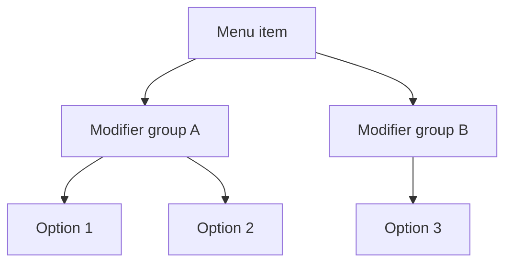
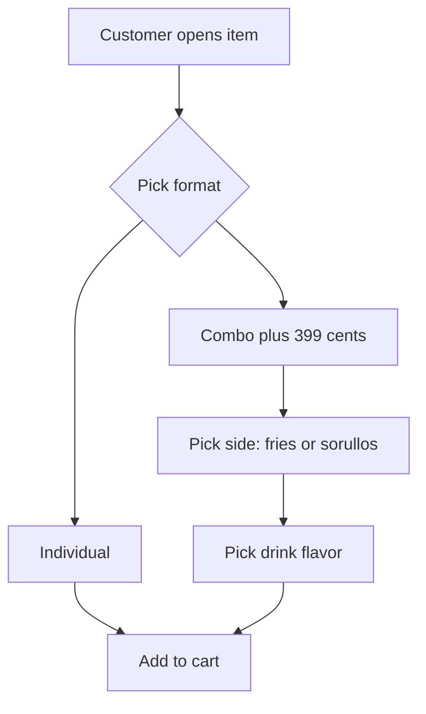
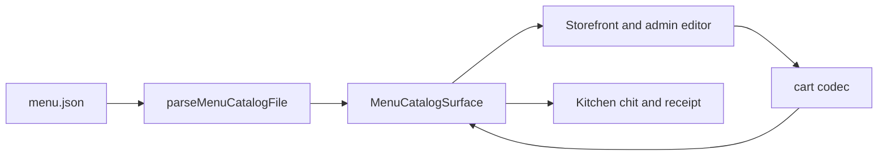

# Specification

How `menu.json` models items, choices, and conditional combo flows. RicoS reads the same shape at checkout, on tickets, and in the admin editor.

## Document shape

Each catalog file has release fields plus a menu body:

| Field | Purpose |
|-------|---------|
| `catalogVersion` | Integer bumped on every publish |
| `publishedAt` | ISO timestamp; must increase each publish |
| `restaurant`, `menuName` | Bilingual labels |
| `categories[]` | Menu sections |
| `orderFees` | Checkout fees (e.g. service charge rate) |

Each **category** has `id`, bilingual `title`, optional `notes[]`, and `items[]`.

Each **item** has `id`, bilingual `name` / `description`, `priceCents`, `station` (`A`, `B`, or `default`), tax rates, and optional `modifierGroups[]`.

## Modifier groups

A modifier group is a set of choices for one item (e.g. “Pancake or waffle”, “Make it a combo”).

| Field | Meaning |
|-------|---------|
| `id` | Stable key stored in cart selections |
| `title` | Bilingual group label shown to staff and customers |
| `selectionType` | `single` or `multiple` |
| `required` | Customer must pick when the group is **active** |
| `minSelections` / `maxSelections` | How many options can be picked |
| `options[]` | Each option has `id`, bilingual `label`, and optional `priceDeltaCents` (surcharge) |

Cart selections are flat: `{ "groupId": ["optionId"] }`.



## Conditional groups (`visibleWhen`)

Some choices only apply after another choice is made. Example: combo side and drink only matter when the customer picks **Combo**.

Add optional `visibleWhen` on a modifier group:

```json
"visibleWhen": {
  "groupId": "mod_sandwich_format",
  "optionIds": ["opt_format_combo"]
}
```

**Rules:**

- No `visibleWhen` → group is always active.
- With `visibleWhen` → group is **active** only when the parent group includes one of `optionIds`.
- When inactive: customer must **not** pick anything; stale picks are rejected at checkout.
- When active: normal `required` / min / max rules apply.
- Combo surcharges use `priceDeltaCents` on the combo **option** (not on side/drink).





## Example: sandwiches combo

Category `cat_sandwiches` uses three modifier groups on each sandwich item:

1. **`mod_sandwich_format`** (always shown, required)
   - `opt_format_individual` — no surcharge
   - `opt_format_combo` — `priceDeltaCents: 399`

2. **`mod_combo_side`** (shown only when Combo is selected, required when active)
   - `opt_side_fries` / `opt_side_sorullos`
   - `visibleWhen`: parent `mod_sandwich_format`, option `opt_format_combo`

3. **`mod_combo_drink`** (same visibility as side, required when active)
   - Placeholder flavors: Coke, Sprite, Diet Coke

Category `notes` carry the printed-menu callout (e.g. “Hazlo combo: escoge papas fritas o sorullos y refresco (+$3.99).”).

**Individual order** — selections:

```json
{ "mod_sandwich_format": ["opt_format_individual"] }
```

**Combo order** — selections:

```json
{
  "mod_sandwich_format": ["opt_format_combo"],
  "mod_combo_side": ["opt_side_fries"],
  "mod_combo_drink": ["opt_drink_coke"]
}
```

Reuse the same group and option ids across sandwich items so behavior stays consistent.

## Authoring tips

- Put the **parent** group first in `modifierGroups` (e.g. format before side/drink).
- Use the RicoS admin editor fields **Show only when group ID** and **Show only when option IDs** for `visibleWhen`; no need to hand-edit JSON unless you prefer it.
- Every publish: increment `catalogVersion` by 1 and set a later `publishedAt`. CI validates schema (including `visibleWhen`) via `scripts/parse-menu-catalog.mjs`.
