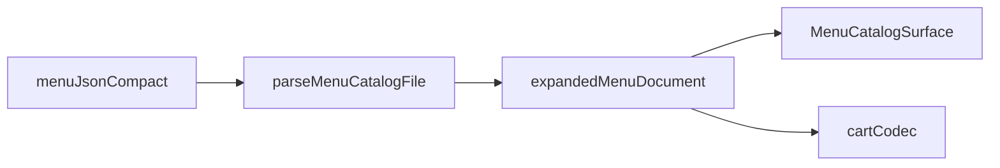

# Specification

How `menu.json` models menu data on disk. Parsing expands compact refs into the same runtime item shape used by RicoS checkout, kitchen tickets, and admin tooling.

## Document shape

Each catalog file has release fields plus a menu body:

| Field | Purpose |
|-------|---------|
| `catalogVersion` | Integer bumped on every publish |
| `publishedAt` | ISO timestamp; must increase each publish |
| `restaurant`, `menuName` | Bilingual labels |
| `orderFees` | Checkout fees (e.g. service charge rate) |
| `modifierGroups` | Optional global registry of reusable modifier groups |
| `categories[]` | Menu sections |

Each category has:

- `id`, localized `title`, `notes[]`, `items[]`
- optional `modifierGroupRefs: string[]` (default modifier stack for all items in the category)

Each item has:

- `id`, localized `name`, localized `description`, `priceCents`, `station`, tax rates
- either inline `modifierGroups[]` (legacy) or `modifierGroupRefs[]` (compact)

## Two primitives for modifiers

### 1) `modifierGroups` registry

Top-level object map from modifier group id to full group definition:

```json
"modifierGroups": {
  "mod_sandwich_format": {
    "id": "mod_sandwich_format",
    "title": { "en": "Make it a Combo", "es": "Hazlo Combo" },
    "selectionType": "single",
    "required": true,
    "minSelections": 1,
    "maxSelections": 1,
    "options": [
      { "id": "opt_format_individual", "label": { "en": "Individual", "es": "Individual" } },
      { "id": "opt_format_combo", "label": { "en": "Combo", "es": "Combo" }, "priceDeltaCents": 399 }
    ]
  }
}
```

### 2) `modifierGroupRefs`

Ordered list of group ids attached to a category or item:

```json
"modifierGroupRefs": [
  "mod_sandwich_bread",
  "mod_tortilla_type",
  "mod_sandwich_format",
  "mod_combo_side",
  "mod_combo_drink"
]
```

Order is preserved and controls display/validation order.

## Resolution rules

Parser resolution (before normal item validation):

1. `refs = item.modifierGroupRefs ?? category.modifierGroupRefs`
2. If `refs` exist:
   - each id must exist in top-level `modifierGroups`
   - refs must not repeat ids
   - parser expands refs into inline `item.modifierGroups[]`
3. If no refs and item has inline `modifierGroups[]`, parse inline directly (legacy path)
4. If both `modifierGroupRefs` and inline `modifierGroups` are set on the same item, validation fails

After parse, runtime always sees inline `item.modifierGroups[]`.



## Conditional groups (`visibleWhen`)

`visibleWhen` stays unchanged and is evaluated on expanded groups:

```json
"visibleWhen": {
  "groupId": "mod_sandwich_format",
  "optionIds": ["opt_format_combo"]
}
```

Rules:

- No `visibleWhen` -> group is always active.
- With `visibleWhen` -> active only when parent group includes one matching option id.
- Inactive groups must not be selected; active groups follow normal required/min/max rules.

## Authoring rules

- Prefer registry + refs over copy-paste inline groups.
- Put shared stacks at category level (`category.modifierGroupRefs`) and override per item only when needed.
- One group id must represent one stable definition. Do not reuse one id for different option sets.
- Parent groups should appear before groups that depend on them with `visibleWhen`.
- Every publish: increment `catalogVersion` by 1 and set a later `publishedAt`.
